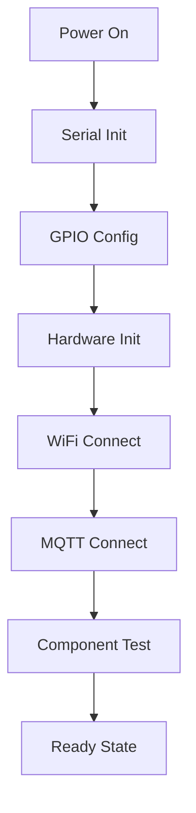
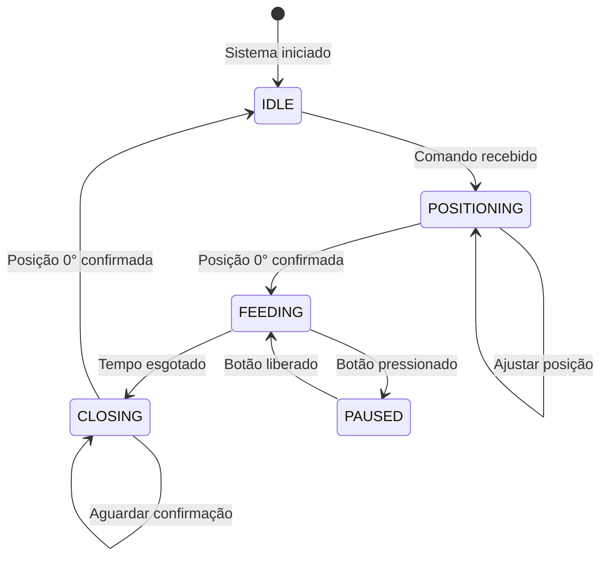

# 📖 Documentação Técnica - Alimentador Automático ESP32 REMOTA

## 📋 Índice

1. [Arquitetura do Software](#arquitetura-do-software)
2. [Fluxo de Funcionamento](#fluxo-de-funcionamento)
3. [Componentes e Classes](#componentes-e-classes)
4. [Estados do Sistema](#estados-do-sistema)
5. [Protocolos de Comunicação](#protocolos-de-comunicação)
6. [Algoritmos de Controle](#algoritmos-de-controle)
7. [Gerenciamento de Memória](#gerenciamento-de-memória)
8. [Tratamento de Erros](#tratamento-de-erros)

## 🏗️ Arquitetura do Software

### Diagrama de Componentes

```
┌─────────────────────────────────────────────────────────┐
│                    PRINCIPAL.CPP                        │
├─────────────────────────────────────────────────────────┤
│  ┌─────────────┐  ┌─────────────┐  ┌─────────────┐      │
│  │ WiFiManager │  │ MQTTManager │  │ServoControl │      │
│  └─────────────┘  └─────────────┘  └─────────────┘      │
│  ┌─────────────┐  ┌─────────────┐  ┌─────────────┐      │
│  │ SensorHall  │  │   Buttons   │  │ LEDControl  │      │
│  └─────────────┘  └─────────────┘  └─────────────┘      │
├─────────────────────────────────────────────────────────┤
│                 ESP32 HARDWARE LAYER                    │
└─────────────────────────────────────────────────────────┘
```

### Estrutura de Arquivos

```
Alimentador_remota/
├── src/
│   ├── principal.cpp          # Aplicação principal
│   ├── ServoControl.cpp       # Controle do servo motor
│   └── SensorHall.cpp         # Interface do sensor Hall
├── include/
│   ├── ServoControl.h         # Header do servo
│   └── SensorHall.h          # Header do sensor
├── lib/                       # Bibliotecas locais
├── platformio.ini            # Configuração do projeto
└── README.md                 # Documentação principal
```

## 🔄 Fluxo de Funcionamento

### 1. Inicialização do Sistema



### 2. Loop Principal

```cpp
void loop() {
    // 1. Manter conexões ativas
    wifiManager.verificarConexao();
    mqttManager.verificarConexao();

    // 2. Processar comunicação
    mqttManager.loop();

    // 3. Interfaces físicas
    processarBotao();
    atualizarLedStatus();

    // 4. Lógica de alimentação
    sistemaAlimentacao();

    // 5. Monitoramento
    monitorarSistema();
    enviarHeartbeat();

    delay(50); // Anti-sobrecarga
}
```

### 3. Máquina de Estados da Alimentação



## 🧩 Componentes e Classes

### ServoControl

```cpp
class ServoControl {
private:
    Servo servo;
    int pino;
    int anguloAtual;

public:
    void iniciar(int pin);
    void ativar();
    void moverParaAngulo(int angulo);
    int obterAngulo();
};
```

**Responsabilidades:**

- Controle PWM do servo motor
- Posicionamento preciso (0° e 90°)
- Gerenciamento de estado angular

### SensorHall

```cpp
class SensorHall {
private:
    int pino;
    bool estadoAtual;
    bool estadoAnterior;

public:
    void iniciar(int pin);
    void verificar();
    bool estaDetectando();
    bool mudouEstado();
};
```

**Responsabilidades:**

- Leitura digital do sensor Hall A3144
- Detecção de mudanças de estado
- Confirmação de posição do servo

### WiFiManager

```cpp
class WiFiManager {
private:
    const char* ssid;
    const char* password;
    bool conectado;

public:
    void iniciar();
    bool conectar();
    void verificarConexao();
    bool estaConectado();
};
```

**Responsabilidades:**

- Gerenciamento de conexão WiFi
- Reconexão automática
- Monitoramento de status

### MQTTManager

```cpp
class MQTTManager {
private:
    WiFiClientSecure wifiClient;
    PubSubClient mqttClient;
    WiFiManager* wifiManager;

public:
    void iniciar();
    bool conectar();
    void loop();
    bool publicar(const char* topic, String payload);
    void subscrever(const char* topic);
    void definirCallback(CallbackFunction callback);
};
```

**Responsabilidades:**

- Comunicação MQTT com SSL/TLS
- Gerenciamento de tópicos
- Reconexão automática
- Callback para mensagens recebidas

## 🔄 Estados do Sistema

### Estados Principais

| Estado      | Descrição           | Variáveis Chave            |
| ----------- | ------------------- | -------------------------- |
| **IDLE**    | Sistema em repouso  | `alimentacaoAtiva = false` |
| **FEEDING** | Alimentação ativa   | `alimentacaoAtiva = true`  |
| **PAUSED**  | Alimentação pausada | `servoTravado = true`      |
| **ERROR**   | Estado de erro      | Logs de erro               |

### Transições de Estado

```cpp
// IDLE → FEEDING
void iniciarAlimentacao(int tempoSegundos) {
    alimentacaoAtiva = true;
    inicioAlimentacao = millis();
    tempoAlimentacaoSegundos = tempoSegundos;
    // ... lógica de inicialização
}

// FEEDING → IDLE
void pararAlimentacao() {
    alimentacaoAtiva = false;
    servoTravado = false;
    // ... lógica de finalização
}
```

### Variáveis de Estado Global

```cpp
// Controle de alimentação
bool alimentacaoAtiva = false;
bool servoAberto = false;
int tempoAlimentacaoSegundos = 5;
unsigned long inicioAlimentacao = 0;

// Controle manual
bool servoTravado = false;
bool estadoBotaoAnterior = HIGH;

// Comunicação
String idComandoAtual = "";
unsigned long ultimoHeartbeat = 0;
```

## 📡 Protocolos de Comunicação

### MQTT com SSL/TLS

```cpp
// Configuração SSL
wifiClient.setCACert(CA_CERT);
wifiClient.setCertificate(CLIENT_CERT);
wifiClient.setPrivateKey(CLIENT_KEY);

// Configuração MQTT
mqttClient.setServer(MQTT_SERVER, MQTT_PORT);
mqttClient.setCallback(callbackMQTT);
```

### Formato de Mensagens

#### Comando JSON

```json
{
  "acao": "alimentar",
  "tempo": 5,
  "remota_id": 1,
  "timestamp": 1234567890
}
```

#### Status Response

```json
{
  "status": "DISPONIVEL",
  "timestamp": 1234567890,
  "servo_posicao": 0,
  "sensor_hall": true
}
```

#### Heartbeat Detalhado

```json
{
  "status": "ALIVE",
  "remota_id": 1,
  "uptime": 1234567890,
  "wifi_rssi": -45,
  "free_heap": 200000,
  "alimentacao_ativa": false,
  "servo_travado": false,
  "last_feed": 1234567800
}
```

### Processamento de Comandos

```cpp
void processarComandoCentral(String payload) {
    // 1. Comandos simples
    if (payload == "PING") return enviarStatusMQTT("PONG");
    if (payload == "STOP") return pararAlimentacao();

    // 2. Comandos JSON
    if (payload.indexOf("\"acao\":\"alimentar\"") > 0) {
        // Extrair parâmetros
        int tempo = extrairTempo(payload);
        int remotaId = extrairRemotaId(payload);

        // Validar e executar
        if (validarParametros(tempo, remotaId)) {
            iniciarAlimentacao(tempo);
        }
    }

    // 3. Comandos legados
    if (payload.startsWith("a")) {
        int tempo = payload.substring(1).toInt();
        iniciarAlimentacao(tempo);
    }
}
```

## ⚙️ Algoritmos de Controle

### Algoritmo de Alimentação por Tempo

```cpp
void sistemaAlimentacao() {
    if (!alimentacaoAtiva || servoTravado) return;

    unsigned long agora = millis();
    unsigned long tempoDecorrido = (agora - inicioAlimentacao) / 1000;

    sensorHall.verificar();
    bool sensorDetectando = sensorHall.estaDetectando();

    if (!servoAberto) {
        // FASE 1: Confirmar posição 0° (fechado)
        if (sensorDetectando) {
            if (agora - ultimoMovimento >= TEMPO_MOVIMENTO) {
                // Abrir para 90° (alimentação)
                servo.moverParaAngulo(90);
                servoAberto = true;
                ultimoMovimento = agora;
            }
        } else {
            // Reposicionar para 0°
            servo.moverParaAngulo(0);
            ultimoMovimento = agora;
        }
    } else {
        // FASE 2: Manter em 90° pelo tempo especificado
        if (tempoDecorrido >= tempoAlimentacaoSegundos) {
            // Fechar para 0°
            servo.moverParaAngulo(0);
            servoAberto = false;

            // Verificar confirmação
            delay(500);
            sensorHall.verificar();
            if (sensorHall.estaDetectando()) {
                // Alimentação concluída
                enviarConclusaoMQTT(tempoDecorrido);
                pararAlimentacao();
            }
        }
    }
}
```

### Algoritmo de Controle Manual

```cpp
void processarBotao() {
    bool estadoBotao = digitalRead(PINO_BOTAO);

    // Debounce
    if (estadoBotao != estadoBotaoAnterior) {
        unsigned long agora = millis();
        if (agora - ultimoDebounce > DEBOUNCE_DELAY) {

            if (estadoBotao == LOW) { // Botão pressionado
                if (!servoTravado) {
                    // TRAVAR em 90° (alimentação contínua)
                    servoTravado = true;
                    servo.moverParaAngulo(90);
                    enviarStatusMQTT("servo_travado_90");
                } else {
                    // DESTRAVAR e voltar para 0°
                    servoTravado = false;
                    servo.moverParaAngulo(0);
                    enviarStatusMQTT("sistema_ativo_0");
                }
            }
            ultimoDebounce = agora;
        }
        estadoBotaoAnterior = estadoBotao;
    }
}
```

### Algoritmo de Reconexão

```cpp
void verificarConexao() {
    // WiFi
    if (!WiFi.isConnected()) {
        Serial.println("WiFi desconectado, reconectando...");
        WiFi.reconnect();
        return;
    }

    // MQTT
    if (!mqttClient.connected()) {
        Serial.println("MQTT desconectado, reconectando...");
        conectarMQTT();
    }
}

bool conectarMQTT() {
    int tentativas = 0;
    while (!mqttClient.connected() && tentativas < 3) {
        if (mqttClient.connect(MQTT_CLIENT_ID, MQTT_USERNAME, MQTT_PASSWORD)) {
            mqttClient.subscribe(TOPIC_COMANDO);
            return true;
        }
        tentativas++;
        delay(2000);
    }
    return false;
}
```

## 💾 Gerenciamento de Memória

### Uso de Memória

- **RAM**: ~46KB / 327KB (14.1%)
- **Flash**: ~916KB / 1310KB (69.9%)

### Otimizações Implementadas

```cpp
// 1. Uso de String otimizado
String criarPayload(const char* status) {
    String payload;
    payload.reserve(200); // Pré-alocar memória
    payload = "{\"status\":\"";
    payload += status;
    payload += "\",\"timestamp\":";
    payload += String(millis());
    payload += "}";
    return payload;
}

// 2. Limpeza de variáveis
void limparComando() {
    idComandoAtual = "";      // Liberar string
    inicioAlimentacao = 0;    // Reset timestamp
}

// 3. Delays não-bloqueantes
unsigned long ultimaVerificacao = 0;
const unsigned long INTERVALO = 1000;

void verificacaoPeriodicica() {
    unsigned long agora = millis();
    if (agora - ultimaVerificacao >= INTERVALO) {
        // Executar verificação
        ultimaVerificacao = agora;
    }
}
```

### Monitoramento de Heap

```cpp
void monitorarMemoria() {
    static unsigned long ultimoLog = 0;
    if (millis() - ultimoLog >= 60000) { // A cada minuto
        Serial.printf("Free Heap: %d bytes\n", ESP.getFreeHeap());
        Serial.printf("Min Free Heap: %d bytes\n", ESP.getMinFreeHeap());
        ultimoLog = millis();
    }
}
```

## 🚨 Tratamento de Erros

### Tipos de Erro

1. **Erros de Hardware**

   - Servo não responde
   - Sensor Hall falha
   - Botão travado

2. **Erros de Comunicação**

   - WiFi desconectado
   - MQTT offline
   - Timeout de resposta

3. **Erros de Estado**
   - Comando inválido
   - Estado inconsistente
   - Timeout de operação

### Estratégias de Recuperação

```cpp
// 1. Recuperação de Hardware
void recuperarServo() {
    Serial.println("Tentando recuperar servo...");
    servo.ativar();
    servo.moverParaAngulo(0);
    delay(2000);

    // Verificar resposta
    sensorHall.verificar();
    if (!sensorHall.estaDetectando()) {
        Serial.println("Servo não respondeu, repetindo...");
        servo.moverParaAngulo(0);
        delay(2000);
    }
}

// 2. Recuperação de Comunicação
void recuperarComunicacao() {
    if (!wifiManager.estaConectado()) {
        wifiManager.conectar();
    }

    if (!mqttManager.estaConectado()) {
        mqttManager.conectar();
        mqttManager.subscrever(TOPIC_COMANDO);
    }
}

// 3. Timeout de Operação
bool executarComTimeout(void (*funcao)(), unsigned long timeout) {
    unsigned long inicio = millis();

    funcao();

    while (millis() - inicio < timeout) {
        if (operacaoConcluida()) {
            return true;
        }
        delay(100);
    }

    Serial.println("Timeout na operação!");
    return false;
}
```

### Logs de Debug

```cpp
#define DEBUG_LEVEL 2

void logDebug(int level, const char* mensagem) {
    if (level <= DEBUG_LEVEL) {
        Serial.printf("[DEBUG-%d] %s\n", level, mensagem);
    }
}

void logErro(const char* erro, const char* funcao) {
    Serial.printf("[ERRO] %s em %s\n", erro, funcao);
    enviarStatusMQTT(String("ERRO_") + String(funcao));
}
```

## 📊 Métricas de Performance

### Tempos de Resposta

- **Comando MQTT**: < 100ms
- **Movimento do Servo**: ~2000ms
- **Confirmação do Sensor**: < 50ms
- **Reconexão WiFi**: ~5000ms
- **Reconexão MQTT**: ~2000ms

### Intervalos de Operação

```cpp
const unsigned long TEMPO_MOVIMENTO = 2000;        // 2s servo
const unsigned long DEBOUNCE_DELAY = 50;           // 50ms botão
const unsigned long INTERVALO_HEARTBEAT = 30000;   // 30s heartbeat
const unsigned long INTERVALO_MONITORAMENTO = 1000; // 1s monitor
```

---

**Esta documentação fornece uma visão técnica completa do sistema, permitindo manutenção, debugging e extensões futuras.**
